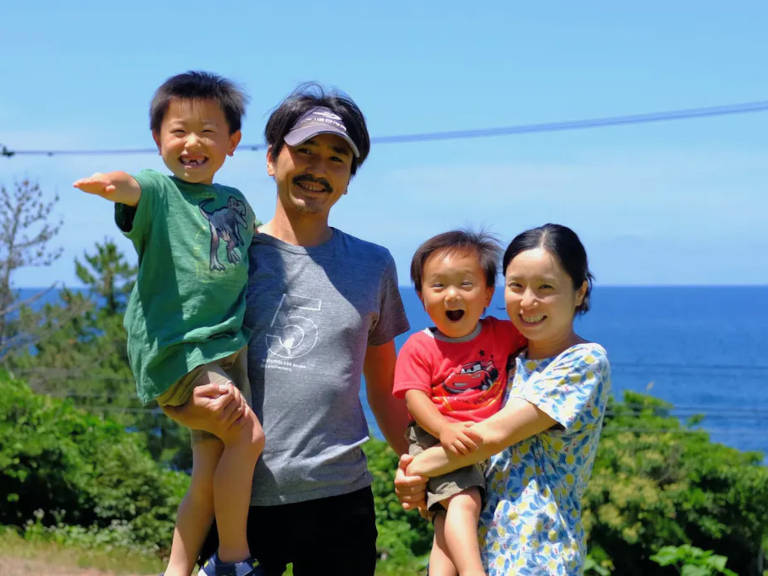

## vol.1 田舎はクリエイティブだ！故郷で吹きガラス工房を立ち上げ ― 長谷川 渡 さん

国見地区出身で、一度故郷を離れるも、Uターンして戻ってきた。  
[WATARIGLASS studio](https://watariglass.com) を運営する吹きガラス職人であり、国見 海・人・暮らし相談室の会長。  
口数が少なく、声が小さいのをリーダーとしての欠点だと自身について語るが、情熱を内に秘め、アーティストならではの視点で、国見地区の地域振興を牽引する第一人者。  

### 普段はどんなことをされていますか？

海辺の小高い丘にある小さな吹きガラス工房「ワタリグラススタジオ」を運営しています。  
工房見学や制作体験も受け付けていて、開かれた工房を目指しています。  
愛知、岐阜、神奈川、東京、福島、静岡、台湾と、あちこち転々としながら10年間程修行して、ようやく念願だった故郷の国見で、個人の工房をゼロから立ち上げることができました。  
それから「越前海岸盛り上げ隊」という観光振興団体の隊長を10年間やっていて、自分ではおおよそリーダー向きの性格ではないと思っているけど、僕の爺さんが色々と地域貢献的な活動やっているのを幼いころから見ていたので、それがカッコイイものだという刷り込みがあったかも知れない。  
今回、「国見 海・人・暮らし相談室」という組織が新しく立ち上がって、一応、会長という役割をやらせてもらっていますが、第一回のツアーから成果に繋げられたのも、越前海岸盛り上げ隊で活動していた経験や実績があってのことだったと思います。  

### 国見で吹きガラス工房を立ち上げた経緯は？

故郷で独立開業することは、揺るぎない目標の一つでした。  
例えば東京でやっていたら、インプットするものが別の人から出力されたものになりがち。それがここでやっていると、インプットがその辺の風景とか、小さな自然の変化とかになり得る。  
それが日常的にあるのが面白いと思っています。  
それから金沢とかに比べて、ここら辺の海岸線でモノ作りをやっている人が少ないと感じていたので、もっと文化的な要素のあることがあっても良いんじゃないか、という想いがありました。  
当初は上手く行くかどうかなんて分からなかったけど、とにかく故郷でやってみたかった。  
うん、ぎこちない説明かも知れないけど、そんな感じ (笑)

### どのような想いで地域活動をしていますか？

「自分達で考えてやってみる」というのが大事だと思って活動を続けています。  
みんなの考えを聞いて、アイディアを持ち寄って、善かれと思う方に進むことは、凄く楽しい。  
これってクリエイティブなことだと思う。形の無いものから形を作ることが、作家活動に近い。  
結果が付いてくれば何よりだけど、それだけが目的ではないと思っています。  
住んでいる町で課題を共有して、それが解決するにせよしないにせよ、そこで生まれた関係性ってその人にとって大事な財産になる。  
大きな町だとレイヤー分けされているようだけど、小さな町でこういう活動をしていると、レイヤーを跨いで思いも寄らない人と出会えたりもするし、それも面白い。  
それぞれ得意なことを頑張って、苦手なことを補い合うみたいなことをしていて、それぞれが埋もれない。  
田舎は自然環境も良いけど、僕はそんなコンパクトなコミュニティが好きでやっているかな。  
どんな人も、掘り下げれば面白い人ばかりなんですよね。  

### 空き家ツアーの参加者へ向けて一言

正直言って、僕らはこのままこの土地で逃げ切れるんですよね。でも、子供の世代のことを考えると、今やれることがあるはず。今しかない、くらいの切迫感があります。  
でもここで暮らしていて、その切迫感が逆に面白いと思っています。  
具体的な課題があって、なおかつ自分にできることがあって、しかもそれが全く無理でも無さそうに見える。  
やりようによっては達成できそうな、大きな課題に向き合っているのって、実はクリエイティブですよね。  
そんな風なことを一緒に考えてくれる仲間が増えると良いなぁ、と思っています。
