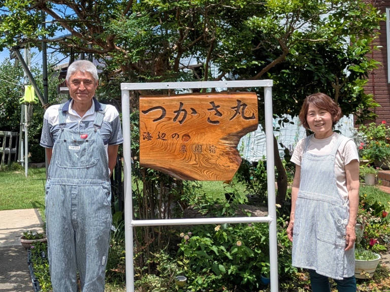

## vol.3 目指すは田舎暮らしの達人!! 海辺の農園宿を営む ― 松井 司 さん

福井県職員を退任後、[海辺の農園宿「つかさ丸」](https://tsukasamaru.net/)として夫婦で農家民宿を開業。  
田舎暮らしの素晴らしさを都市部の人達に伝えたい、という想いに溢れ、目指しているのは田舎暮らしの達人!!  
国見地区の公民館長を兼務する、私たちの町づくり活動の大黒柱。

### 普段はどんなことをされていますか？

定年まで勤めた公務員を退職したので、自由な田舎暮らしをしようと思って、50年来住んでいる鮎川町で、ほぼ自給自足の生活を目指し、愉しんででいます。  
畑、山林から伐採して薪の調達、ワカメ漁、サザエ漁など、国見の豊かな海と山の資源を存分に活かした暮らしが自慢です。  
総務省の進める都市と農村の交流事業の趣旨に賛同して、海辺の農園宿「つかさ丸」を開業しました。  
田舎暮らしの色んな愉しみを、都会から来てくれた人に伝えたいと思っています。  
公務員生活が終わった後は、地域に貢献できることをやろうと思って、現在は国見公民館の館長、鮎川町自治会の会計係など、いくつかの役を掛け持っています。  

### 海辺の農園宿「つかさ丸」の特徴を教えてください。

自分の畑で作った野菜や、海で獲った食材をふんだんに使った田舎料理・郷土料理を、お客様に味わってもらっています。  
その他に、農山漁村の体験として、野菜の収穫体験や、薪割り体験、豆腐やコンニャクつくり体験も提供しています。  
漁船を所有しているので、季節や天気など条件が揃えば、漁船クルージングも体験してもらい、田舎暮らしの愉しさをPRをしています。  
獲れたての若布のしゃぶしゃぶ（お湯に晒すと鮮やかに色が変わる）を食べてもらって喜んで頂いたり、自家製の人参や玉ねぎ、インゲンの天ぷらなど、お召し上がりいただいていて、普段野菜嫌いだったお子様から「美味しかった！」という感想を頂いたときは、さすがに嬉しかったですね。  
海外からもお客様が来られるので、この前はドイツの方に豆腐作りに挑戦してもらいました。  
また、私たちにとっては当たり前のような海の風景や夕景に感激してもらえることに、私たち自身も驚いています。  

### 国見に住み続ける理由は何ですか？今後やりたいことや続けたいことはありますか？

山もあり、海もあり、こんなに絶好条件の場所はなかなか無いと思っています。生まれ育った土地でもあるから、尚更です。  
私たちには3人の子供が居ますが、ここで育ったから自立心の強い社会人になってくれた、とも思っています。  
今後やりたいことは特にありませんが、健康な身体でいられる限り、この最高の生活を続けていきたいですね。  

### 空き家ツアーの参加者へ向けて一言

田舎暮らしは、不便なことも沢山あるかも知れません。買い物に行くにもスーパーが遠いとか、病院が遠いとか。  
でも、それをはるかに上回る贅沢な暮らしが、ここにはあると思っています。  
だから、言い方は悪いかも知れませんが、田舎暮らしの表面だけでなく、真髄まで味わっていただけるような、アグレッシブな方にぜひ、国見暮らしをお薦めしたいです。  
