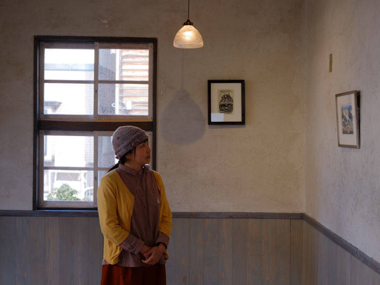

## vol.5 この海辺の風景を版画に残したい ― おさの なおこ さん

2019年末頃、東京都町田市からIターンで移住。  
[版画ゆうびん舎](https://hangakobo.com)として、版画作品、版画を使った日用品・デザイン等を制作し、地域に開かれた版画教室を主催。  
2019年～2022年は、越廼・国見地区の地域おこし協力隊に就任し、ガラス作家の長谷川らと共に、古民家「はりいしゃ」でレジデンシー事業を数多く手掛け、現在も継続中。  

### 普段はどんなことをされていますか？

海辺での暮らしや子育てを楽しみながら、版画制作をしています。  
国見で暮らしていると、お野菜やお魚をお裾分けいただくことが多くて、それらを調理するなど、地元の人に知恵を教えていただきながら、海や山の恵みを活かした生活を学んでいます。  
版画家としては、毎日欠かさずに散歩をして、版画のモチーフになりそうな素材を見つけては、スケッチをしたり写真に撮ったりしています。  
刻々と変化する海や空の色彩や表情は飽きることがありませんし、とりわけ今興味のあるものは、海に迫った裏山（と呼んでいる里山）の植物たちであったりもします。  
季節ごとに姿を変えて現れる多様な植物たち ― 時には食べることのできる実りだったり、何かに使える材料だったり ― を観察し続けることは、ここでの生活を飽きないものにさせてくれます。  

### どのような想いで版画を制作されていますか？

移住当初は、当たり前のように続くと思っていた海辺の風景ですが、そんな風景もある日一瞬で姿を変えることがあります。  
と言うのは、町の象徴的な存在だった松の大木が、あるとき寿命によって切られてしまう、ということがありました。  
そのとき、ここにあった風景を、きちんと描き残しておきたい、と強く思いました。  
越前海岸で特徴的な、太古の面影をそのままに残す岩礁や、ヤブニッケイの原生林さえも、いつかは消えてしまう景色なんじゃないかと、ふと思うことがありますね。  
それが版画を制作する想いの全てではありませんが、この土地に移住してきた私にできることの一つだと思っています。  

### 今後やっていきたいことや続けていきたいことは何ですか？

今、国見地区の隣の越廼という地区で、古民家を改修したギャラリーを運営しています。  
県外からアーティストを呼んで展示会をしてもらうのが主ですが、地元の小・中学校で交流授業をしてもらい、そこで児童・生徒と共同制作した作品も、展示させてもらっています。  
こういう場所だから培われる感性というものもあると思うので、地元の子供達との関わりは、今後も続けていきたいと思っています。  

### 空き家ツアーの参加者へ向けて一言

何組ものアーティストを招聘してきた経験の中で、創造的な視点でこの風景と関わる人たちが、この海辺での暮らしを楽しみ、有意義な滞在制作をしていってくれました。  
もちろんアーティストに限らず、豊かな感性を持った方なら、ここでの暮らしを楽しんでいただけると思います。
