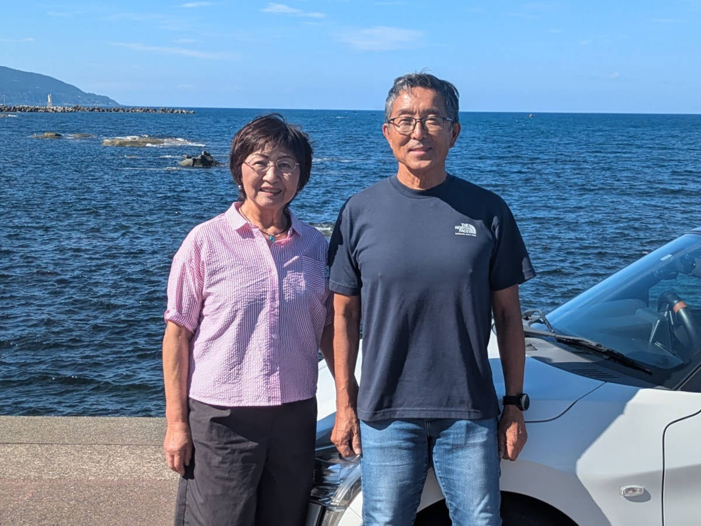

## vol.6 千葉から移住して、自然環境を満喫しているご夫婦 ― 志野 慶一・順子 さん

2022年6月、千葉県よりIターンで移住。  
自衛官退官後、企業顧問（コンサルティング）や民泊などの事業を営みながら、バイク、カヌー、SUP、ジョギング、フィッシングなどを満喫し、国見地区で暮らす。  
相談室では、主にシニア層の移住に関する窓口を担当しつつ、多岐に渡って組織をサポートしてくれる存在。  

### 普段はどんなことをされてますか？

個人事業主として、企業のコンサルティングや民泊事業をしています。  
そのため、月に1～2度の出張や在宅でリモート会議、年間で10校程度の修学旅行生を民泊させてます。  
それ以外は、趣味の時間として充実した余生を送っています。  

### 千葉から移住されたのですね、きっかけは何ですか？

自衛官退官後は永らく住んでた千葉が終の棲家と思ったのですが、数年前に息子が、福井へ移住して塩作りや農業、牧畜の事業を始めたのです。  
それを見に来ているうちに、山あり海ありの自然豊かな国見の生活にあこがれ、良い物件も見つかったため、高齢者ですが思い切って移住を決めました。  

### 趣味を楽しんでおられるようですが、どのような趣味ですか？

私は多趣味ですよ。バイクツーリング、ボートフィッシング、SUPなどアウトドアが大好きです。実益を兼ねて珈琲の自家焙煎、素潜りでサザエ、ビーチのシーグラスクラフトも好きですね。  
妻も、エコクラフトや蕎麦打ち、海藻とりなど楽しんでいます。  
夫婦でも、ガーデニングや山菜取り釣りを楽しんでいます。  

### 移住してどうでしたか？続けられてる理由は？

住民の方とのお付き合いや、災害、生活環境に不安はありましたが、住民の方々にはとても親切にしていただいています。  
移住後に能登半島地震を経験しましたが、地盤の固い国見地区では震度2程度、津波もアラームが鳴ったので避難しましたが数㎝程度でした。  
千葉ではたびたび震度3～4を経験していたので、安心して暮らしています。  
生活環境も買い物や医療関係で不安がありましたが、車で数分のところにスーパーができて、医療も20分くらいで総合病院や各種の医療施設があるので安心です。  
ただし、自家用車は必須アイテムですね。私たちは近くに家族が住んでいるので運転ができなくなれば頼ることになると思います。  

### 地域の活動もされてますか？

移住後地域の様子がわかってきて、お手伝いできることがあれば、高齢者ですが微力ながら協力しようと思っています。  
千葉の集合住宅と違って、地元愛の強い自治会や伝統的行事もあるので、ボランティアの協力はそういった理解も深めることができ楽しいですよ。  
シニアの方が元気なので、お仲間に入れていただき、バレーボールクラブや船主会、海岸清掃のボランティアなどやっています。  

### 空き家マッチングツアー参加者に一言

移住生活をとても満足しています。  
この幸福感、充実感を移住を考えている方にも是非感じていただきたいです。  
自然環境を楽しむことに生きがいを感じる方には、国見地区への移住をお勧めします。  
遊びに来られるご子息、お孫さんの素敵な帰省先としても喜んでもらえます。  
